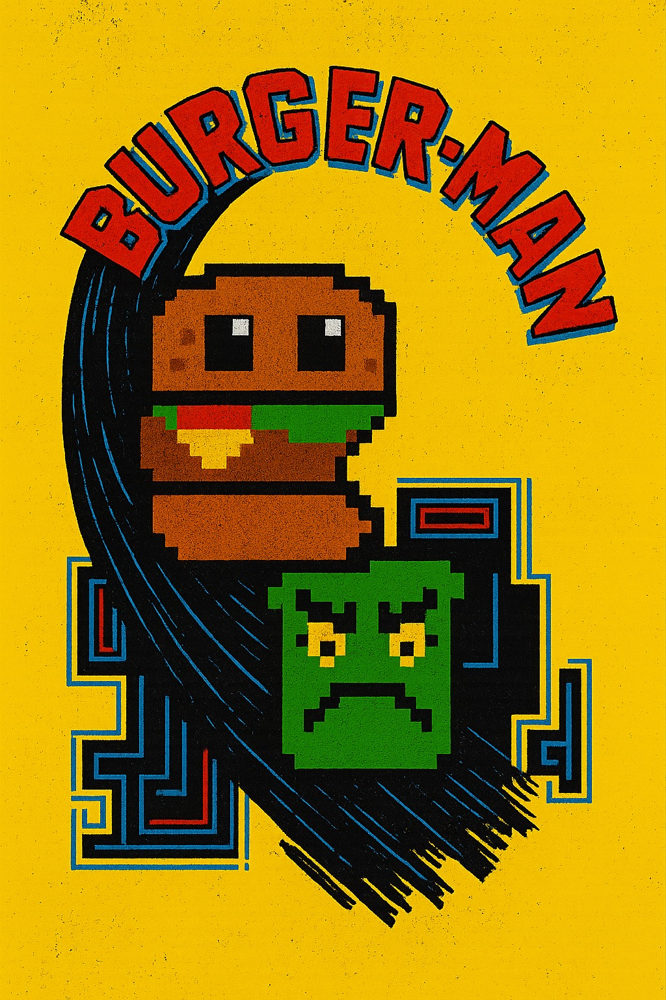

# BurgerMan



> A Java-based Game Engine and Arcade Game.

## Overview
BurgerMan is a custom game engine and arcade game implementation developed in Java inspired by the classic arcade game Pac-Man. It features a robust object management system, collision detection, and a behavior-based entity architecture.

**Note:** This project was developed as a group assignment for the **Object Oriented Programming (POO)** course at the **University of Algarve (UALG)**. The Game Engine was custom-built specifically for this game to demonstrate core OOP principles.
It's not perfect, but it works.

## Features
- **Custom Game Engine**: Dedicated engine implementation for efficient management of game objects, rendering, and updates.
- **Collision Detection**: Precise collision handling for solid objects and intersections.
- **Behavior System**: Modular behavior logic for players, enemies, and interactive objects.
- **GUI Integration**: Built-in graphical user interface for rendering and input handling.
- **Sound Integration**: Built-in sound handling for sound effects.
- **Score System**: Modular score logic for player.
- **High Score System**: Modular high score logic for player.

## Keybinds
Use W A S D to move the player.


## Installation

### Prerequisites
- **Java Development Kit (JDK) 21** or higher.
- **Git** (to clone the repository).

### Quick Start

#### Linux / macOS
1. **Clone the repository:**
   ```bash
   git clone https://github.com/rodrigolinhas/burgerMan.git
   cd burgerMan
   ```

2. **Run the game:**
   ```bash
   ./run.sh
   ```

#### Windows
1. **Clone the repository:**
   ```bash
   git clone https://github.com/rodrigolinhas/burgerMan.git
   cd burgerMan
   ```

2. **Run the game:**
   Double-click `run.bat` or run it from the command prompt:
   ```cmd
   run.bat
   ```

These scripts automatically:
- Download necessary dependencies.
- Compile the source code.
- Copy assets (images, sounds, fonts).
- Launch the game.

### Manual Installation
If you prefer to run it manually:

#### Linux / macOS
1. **Create build directories:**
   ```bash
   mkdir -p bin lib
   ```

2. **Download dependencies:**
   Download `annotations-24.0.0.jar` from Maven Central and place it in the `lib` folder.

3. **Compile:**
   ```bash
   javac -d bin -cp "lib/*" -sourcepath Game/src Game/src/gameEngine/Client.java
   ```

4. **Copy Assets:**
   ```bash
   cp -r Game/src/images Game/src/sounds Game/src/fonts bin/
   ```

5. **Run:**
   ```bash
   java -cp "bin:lib/*" gameEngine.Client
   ```

#### Windows
1. **Create build directories:**
   ```cmd
   mkdir bin
   mkdir lib
   ```

2. **Download dependencies:**
   Download `annotations-24.0.0.jar` from Maven Central and place it in the `lib` folder.

3. **Compile:**
   ```cmd
   javac -d bin -cp "lib/*" -sourcepath Game/src Game/src/gameEngine/Client.java
   ```

4. **Copy Assets:**
   ```cmd
   xcopy "Game\src\images" "bin\images" /E /I /Y
   xcopy "Game\src\sounds" "bin\sounds" /E /I /Y
   xcopy "Game\src\fonts" "bin\fonts" /E /I /Y
   ```

5. **Run:**
   ```cmd
   java -cp "bin;lib/*" gameEngine.Client
   ```

## Project Structure
- `Game/src/gameEngine`: Core engine logic and main entry point.
- `Game/src/collisions`: Collision detection utilities.
- `Game/src/gameEngine/object`: Game entity definitions.
- `Game/src/gameEngine/behaviour`: Entity behavior logic.
- `docs/`: Project documentation and UML diagrams.
- `assets/`: Game assets and images.

## Authors
- [Ricardo Rodrigues](https://github.com/ricardoorodriguess)
- [Rodrigo Linhas](https://github.com/rodrigolinhas)
- [Tiago Tome](https://github.com/TiagoTome1)

---
*Version: March 27, 2025*